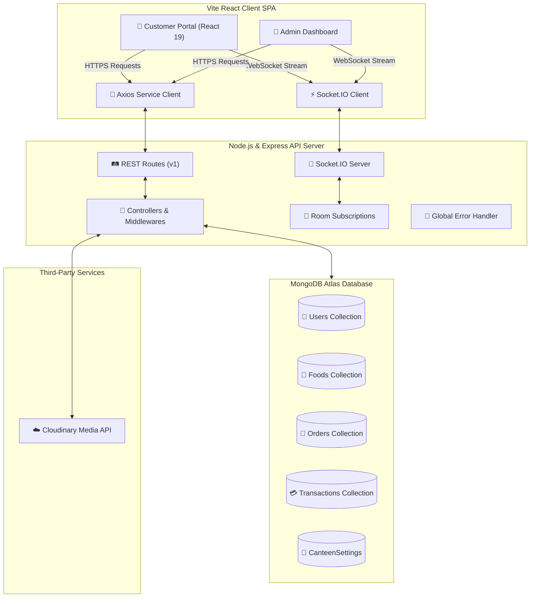
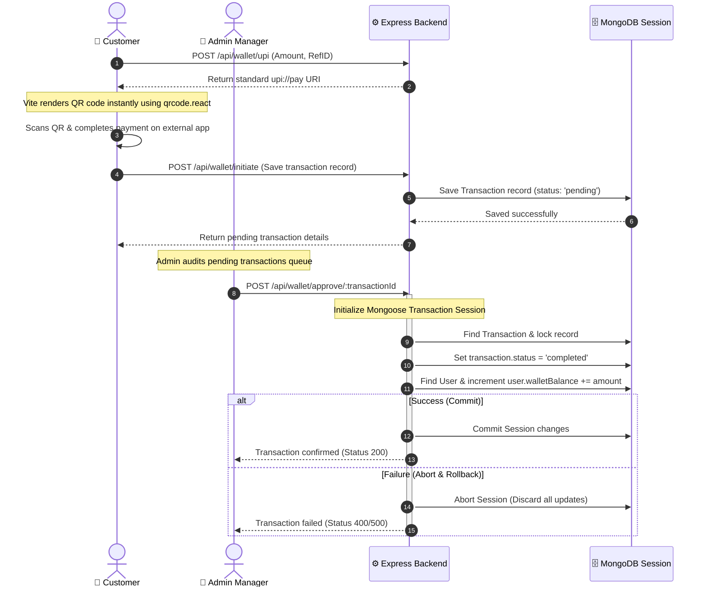

# 🍔 SwiftBytes - Smart Canteen Management System

[](https://nodejs.org/)
[](https://react.dev/)
[](https://expressjs.com/)
[](https://www.mongodb.com/)
[](https://tailwindcss.com/)
[](https://socket.io/)
[](https://opensource.org/licenses/MIT)

Welcome to **SwiftBytes** — a modern, production-ready, full-stack MERN (MongoDB, Express, React, Node) application that transforms canteen operations. SwiftBytes features a secure atomic wallet-ledger deposit system, simulated UPI payment generation, dynamic order status queues, and real-time Socket.IO synchronization.

---

## 🗺️ Table of Contents

- [🚀 Architecture Diagrams](#-architecture-diagrams)
  - [High-Level System Flow](#high-level-system-flow)
  - [Atomic Wallet Lifecycle](#atomic-wallet-lifecycle)
- [📦 Key Offerings & Capabilities](#-key-offerings--capabilities)
- [🗂️ Project Directory Structure](#%EF%B8%8F-project-directory-structure)
- [🛠️ Technology Stack](#%EF%B8%8F-technology-stack)
- [⚙️ Database Schemas (Interactive)](#%EF%B8%8F-database-schemas-interactive)
- [🏃 Local Quick Start](#-local-quick-start)
  - [Prerequisites](#prerequisites)
  - [1. Configuration](#1-configuration)
  - [2. Dependencies](#2-dependencies)
  - [3. Seeding Default Data](#3-seeding-default-data)
  - [4. Running the Dev Servers](#4-running-the-dev-servers)
- [🛤️ Interactive API Route Reference](#%EF%B8%8F-interactive-api-route-reference)
- [🔌 Real-Time Socket.IO Channels](#-real-time-socketio-channels)
- [🚀 Production Deployment Playbook](#-production-deployment-playbook)
- [🛡️ Transaction Ledger & Security Design](#%EF%B8%8F-transaction-ledger--security-design)
- [🔍 Troubleshooting & Common Issues](#-troubleshooting--common-issues)

---

## 🚀 Architecture Diagrams

### High-Level System Flow
The diagram below shows the interaction model between the frontend SPA, real-time channels, Express backend API, database storage, and external assets.



### Atomic Wallet Lifecycle
This sequence explains the process of a customer initiating a wallet credit request via UPI, transferring funds, and the admin approving the ledger update securely inside a Mongoose transaction session.



---

## 📦 Key Offerings & Capabilities

*   **📱 Mobile-First React SPA:** A sleek, fully responsive user experience powered by Tailwind CSS. Fits perfectly on both mobile screens and desktop monitors.
*   **👛 Atomic Wallet Ledger:** Secure deposits and payments wrapped inside database-level atomic sessions to guarantee data consistency.
*   **🔌 Simulated UPI Gateway:** Instant generation of standardized UPI deep-link strings (`upi://pay`), rendered as dynamic, high-resolution QR codes.
*   **👮 Live Order Tracking:** Real-time state synchronization using Socket.IO room events (`Placed` ➔ `Preparing` ➔ `Ready` ➔ `Completed`).
*   **🧾 Invoice Management:** Generate and view digitally formatted order invoices with support for printing daily aggregated sheets.
*   **📈 Dashboard Statistics:** Aggregated analytics reporting trending food items, category top-sellers, and aggregate daily transaction metrics.

---

## 🗂️ Project Directory Structure

```
Swift-Bytes/
├── client/              # React.js SPA (Vite + Tailwind CSS v4)
│   ├── public/          # Static logos & browser icons
│   └── src/
│       ├── components/  # Core UI widgets (Navbar, Cards, Modals)
│       │   └── admin/   # Specialized Admin modal displays
│       ├── context/     # React state Context (Auth, Cart, Canteen status)
│       ├── pages/       # Application views (Home, Cart, Wallet, Orders)
│       │   └── admin/   # Management views (Menu, Orders, Transactions)
│       ├── services/    # Axios HTTP instances & Socket listeners
│       └── utils/       # Common helper functions
├── server/              # Express.js REST API Server
│   ├── config/          # DB connections & runtime configurations
│   ├── controllers/     # Controller layer orchestrating business logic
│   ├── middleware/      # JWT auth, role validation, error interceptors
│   ├── models/          # Schema blueprints using Mongoose ODM
│   ├── routes/          # API endpoint route bindings
│   └── scripts/         # Local DB seeding configuration
├── package.json         # Workspace root managing workspaces
└── vercel.json          # Root serverless rewrite configuration
```

---

## 🛠️ Technology Stack

| Architecture Layer | Core Tech | Description |
| :--- | :--- | :--- |
| **Frontend Framework** | React 19 (Vite) | Quick and modular component building |
| **Styling Library** | Tailwind CSS v4 | Clean utility classes and custom layout properties |
| **Backend Runtime** | Node.js + Express | Highly scalable server environment |
| **Database Store** | MongoDB Atlas | Cloud-hosted NoSQL document database |
| **WebSocket Engine** | Socket.IO | Real-time bi-directional message synchronization |
| **Object Data Modeler**| Mongoose | Schema definitions and validation rules |
| **QR Code Engine** | qrcode.react | Client-side QR matrix generator |
| **Cloud Storage** | Cloudinary | Asset storage for food menu images |

---

## ⚙️ Database Schemas (Interactive)

Click on the models below to view the fields, verification constraints, and structures.

<details>
<summary>👤 User Schema (User.js)</summary>

```javascript
{
  name: { type: String, required: true, trim: true },
  email: { type: String, required: true, unique: true, lowercase: true, trim: true },
  password: { type: String, required: true, minlength: 6 },
  role: { type: String, enum: ['customer', 'admin'], default: 'customer' },
  dietPreference: { type: String, enum: ['all', 'veg', 'nonveg'], default: 'all' },
  walletBalance: { type: Number, required: true, default: 0, min: 0 }
}
```

</details>

<details>
<summary>🍔 Food Schema (Food.js)</summary>

```javascript
{
  name: { type: String, required: true, trim: true },
  category: { type: String, required: true, trim: true },
  description: { type: String, trim: true, maxlength: 500, default: '' },
  price: { type: Number, required: true, min: 0 },
  image: { type: String, required: true, trim: true }, // Cloudinary CDN link
  isVeg: { type: Boolean, default: null },
  available: { type: Boolean, default: true },
  tags: { type: [String], default: [] },
  ratingAvg: { type: Number, default: 0, min: 0, max: 5 },
  ratingCount: { type: Number, default: 0 }
}
```

</details>

<details>
<summary>🧾 Order Schema (Order.js)</summary>

```javascript
{
  userId: { type: ObjectId, ref: 'User', required: true },
  items: [{
    food: { type: ObjectId, ref: 'Food', required: true },
    name: { type: String, required: true },
    price: { type: Number, required: true },
    quantity: { type: Number, required: true, min: 1 }
  }],
  instructions: { type: String, trim: true, maxlength: 300, default: '' },
  paymentMethod: { type: String, enum: ['Cash', 'UPI', 'Wallet'], default: 'Cash' },
  paymentStatus: { type: String, enum: ['Pending', 'Paid'], default: 'Pending' },
  invoiceNumber: { type: String, default: '' },
  invoiceGeneratedAt: { type: Date },
  totalPrice: { type: Number, required: true, min: 0 },
  status: { type: String, enum: ['Placed', 'Preparing', 'Ready', 'Completed', 'Cancelled'], default: 'Placed' },
  tokenNumber: { type: Number, required: true },
  review: {
    rating: { type: Number, min: 1, max: 5 },
    comment: { type: String, trim: true, maxlength: 500 },
    createdAt: { type: Date }
  }
}
```

</details>

<details>
<summary>💳 Transaction Schema (Transaction.js)</summary>

```javascript
{
  userId: { type: ObjectId, ref: 'User', required: true },
  amount: { type: Number, required: true, min: 0.01 },
  type: { type: String, enum: ['credit', 'debit'], required: true },
  status: { type: String, enum: ['pending', 'completed', 'failed'], default: 'pending' },
  referenceId: { type: String, required: true, unique: true, trim: true }
}
```

</details>

<details>
<summary>🏪 CanteenSettings Schema (CanteenSettings.js)</summary>

```javascript
{
  isOpen: { type: Boolean, default: true },
  lastInvoicePrintedDate: { type: Date, default: null },
  updatedBy: { type: ObjectId, ref: 'User' }
}
```

</details>

---

## 🏃 Local Quick Start

Follow these steps to run SwiftBytes on your machine.

### Prerequisites
*   [Node.js](https://nodejs.org/) (v18.0.0 or higher recommended)
*   [MongoDB](https://www.mongodb.com/try/download/community) (running locally or a connection string from Atlas)

### 1. Configuration
Create a `.env` file at the root folder of the project. You can copy the structure below:

```env
PORT=5000
NODE_ENV=development
CLIENT_URL=http://localhost:5173
JWT_SECRET=your_super_secret_jwt_key_here

# MongoDB Atlas or Local connection URI
MONGO_URI=mongodb://127.0.0.1:27017/swiftbytes

# Cloudinary (Optional - For uploading custom food item images)
CLOUDINARY_CLOUD_NAME=your_cloudinary_cloud_name
CLOUDINARY_API_KEY=your_cloudinary_api_key
CLOUDINARY_API_SECRET=your_cloudinary_api_secret
CLOUDINARY_FOLDER=canteen

# UPI Merchant Config
UPI_VPA=merchant@ybl
UPI_NAME=Smart Canteen
```

### 2. Dependencies
Install all requirements across all packages using the workspace root package.json:
```bash
npm install
```

### 3. Seeding Default Data
Run the database seed script to set up default food items and accounts:
```bash
# This creates sample products and dummy accounts:
# 👤 Customer: student123@example.com (Password: student123)
# 👮 Admin Manager: admin123@example.com (Password: admin123)
npm run seed --workspace=server
```

### 4. Running the Dev Servers
Start both the client and server concurrently using workspaces:
```bash
# Start backend server
npm run dev --workspace=server

# Start client development build
npm run dev --workspace=client
```

---

## 🛤️ Interactive API Route Reference

All protected routes below require the header: `Authorization: Bearer <your_jwt_token>`

<details>
<summary>🔑 Authentication Endpoints (`/api/auth`)</summary>

*   `POST /api/auth/register` - Registers a new user.
    *   **Body**:
        ```json
        {
          "name": "Pruthvi Raj",
          "email": "pruthvi@example.com",
          "password": "securepassword123",
          "dietPreference": "veg"
        }
        ```
*   `POST /api/auth/login` - Logs in and returns a JWT token.
    *   **Body**:
        ```json
        {
          "email": "pruthvi@example.com",
          "password": "securepassword123"
        }
        ```
    *   **Response**: Contains user profile payload and `token`.
*   `GET /api/auth/me` (Protected) - Fetches info about the currently logged-in user.

</details>

<details>
<summary>🍔 Food Menu Endpoints (`/api/food`)</summary>

*   `GET /api/food` - Returns list of food items. Filterable via query params (e.g. `?category=Snacks&search=paneer`).
*   `GET /api/food/categories` - Returns array of available categories.
*   `GET /api/food/:id` - Details for a single food item.
*   `GET /api/food/:id/pairs` - Returns complementary menu items frequently purchased with this item.
*   `POST /api/food` (Protected, Admin Only) - Adds a new food item.
*   `PUT /api/food/:id` (Protected, Admin Only) - Modifies an existing item.
*   `DELETE /api/food/:id` (Protected, Admin Only) - Removes a food item from the system.

</details>

<details>
<summary>🛒 Order Endpoints (`/api/orders`)</summary>

*   `POST /api/orders` (Protected) - Place a new order.
    *   **Body**:
        ```json
        {
          "items": [
            { "food": "60d5ec49e9b0b411d0cf884f", "name": "Paneer Roll", "price": 80, "quantity": 2 }
          ],
          "instructions": "Make it extra spicy",
          "paymentMethod": "Wallet"
        }
        ```
*   `GET /api/orders/my` (Protected) - Retrieves previous order list for the logged-in customer.
*   `GET /api/orders` (Protected, Admin Only) - Lists all active and closed orders across the platform.
*   `POST /api/orders/:id/review` (Protected) - Leaves feedback for the order.
    *   **Body**: `{ "rating": 5, "comment": "Amazing quality!" }`
*   `GET /api/orders/:id/invoice` (Protected) - Fetches receipt parameters.
*   `PUT /api/orders/:id/status` (Protected, Admin Only) - Moves order step.
    *   **Body**: `{ "status": "Preparing" }`
*   `PUT /api/orders/:id/payment` (Protected, Admin Only) - Manually changes payment status.
    *   **Body**: `{ "paymentStatus": "Paid" }`
*   `PUT /api/orders/:id/cancel` (Protected) - Cancels order. Auto-refunds the total price back to user balance if payment method was `Wallet`.

</details>

<details>
<summary>💳 Wallet & Balance Endpoints (`/api/wallet`)</summary>

*   `POST /api/wallet/upi` (Protected) - Generates a dynamic UPI standard payment deep-link.
    *   **Body**: `{ "amount": 250, "referenceId": "TXN998811" }`
    *   **Response**: `{ "upiString": "upi://pay?pa=merchant@ybl&pn=Smart%20Canteen&am=250.00&tr=TXN998811..." }`
*   `POST /api/wallet/initiate` (Protected) - Registers a pending recharge transaction.
    *   **Body**: `{ "amount": 250, "referenceId": "TXN998811" }`
*   `GET /api/wallet/my` (Protected) - Returns transactions ledger for the active user.
*   `GET /api/wallet/admin/all?status=pending` (Protected, Admin Only) - Returns pending wallet deposit audit requests.
*   `POST /api/wallet/approve/:transactionId` (Protected, Admin Only) - Approves transaction and credits user.

</details>

---

## 🔌 Real-Time Socket.IO Channels

SwiftBytes uses Socket.IO to notify customers and admins of real-time events.

### Events Triggered
*   `joinUser`: Triggered by the client when logging in. Associates the socket connection with the user room `user:<userId>`.
*   `orderUpdated`: Broadcasts to `user:<userId>` whenever an administrator updates their active order status (e.g., changing status from `Preparing` to `Ready`). Triggered in [orderController.js](file:///c:/Users/ADMIN/OneDrive/Desktop/web%20dev%20pro/Swift-Bytes/server/controllers/orderController.js).

---

## 🚀 Production Deployment Playbook

### 1. Client Deployment (Vercel)
1.  Connect your GitHub repository to **Vercel**.
2.  Set the **Root Directory** settings option to `client`.
3.  Add the environment variables in Vercel settings:
    *   `VITE_API_URL` = `https://your-backend.render.com/api`
    *   `VITE_SOCKET_URL` = `https://your-backend.render.com`
4.  Vercel will build the React bundle and handle index fallback routing using [client/vercel.json](file:///c:/Users/ADMIN/OneDrive/Desktop/web%20dev%20pro/Swift-Bytes/client/vercel.json).

### 2. Server Deployment (Render/Railway)
1.  Create a web service pointing to the project repository.
2.  Set the base directory target configuration to `server` (or run server commands from the root directory).
3.  Set the environment variables:
    *   `CLIENT_URL` = `https://your-client.vercel.app` (no trailing slash)
    *   `MONGO_URI` = `mongodb+srv://...`
    *   `JWT_SECRET` = `...`
    *   `NODE_ENV` = `production`
4.  Run `npm install` and start using `npm start`.

---

## 🛡️ Transaction Ledger & Security Design

1.  **Atomic Balance Mutations:** Wallet balance increments and deductions are executed inside MongoDB transaction sessions (`mongoose.startSession()`). If a database write fails or user balance would drop below zero, the transaction is automatically aborted, rollback occurs, and no balance state changes.
2.  **Server-Calculated Totals:** Order prices are fetched from the database's `Food` collections during checkout. User payment totals are calculated on the server rather than reading values sent by the client.
3.  **Strict Middleware Protection:** Admin routes are secured by chaining both `protect` (JWT validation) and `adminOnly` (role verification) middlewares.

---

## 🔍 Troubleshooting & Common Issues

<details>
<summary>❌ Database Error: Mongoose Transactions on Standalone MongoDB</summary>

**Issue**: MongoDB transaction sessions require a **Replica Set** cluster. Running transactions on a standalone local MongoDB process will crash with:
`Error: This MongoDB deployment does not support retryable writes / sessions`

**Solution**:
1. Run local MongoDB as a single-node replica set. Run `mongod --replSet rs0` and run `rs.initiate()` in mongo shell once.
2. Or use a free **MongoDB Atlas** database cluster, which automatically supports replica sets.

</details>

<details>
<summary>❌ Socket Connection Failed: CORS Errors</summary>

**Issue**: Browser console throws CORS block errors during Socket.IO connection.

**Solution**:
Verify that `CLIENT_URL` in server configuration `.env` matches your Vite client hostname (`http://localhost:5173`) exactly, with **no trailing slash**.

</details>

<details>
<summary>❌ Vercel Client Routes Give 404 on Refresh</summary>

**Issue**: Refreshing the client website page on `/orders` or `/wallet` returns a Vercel 404 error page.

**Solution**:
Make sure the client folder contains [vercel.json](file:///c:/Users/ADMIN/OneDrive/Desktop/web%20dev%20pro/Swift-Bytes/client/vercel.json) with SPA rewrite rules:
```json
{
  "rewrites": [{ "source": "/(.*)", "destination": "/index.html" }]
}
```

</details>

---

<h3>Crafted with 💙 by Pruthvi Raj</h3>
